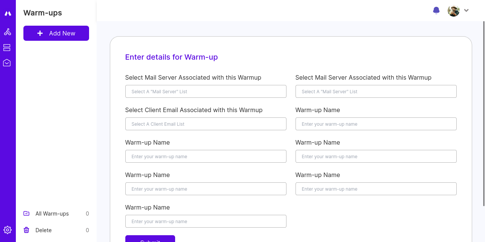
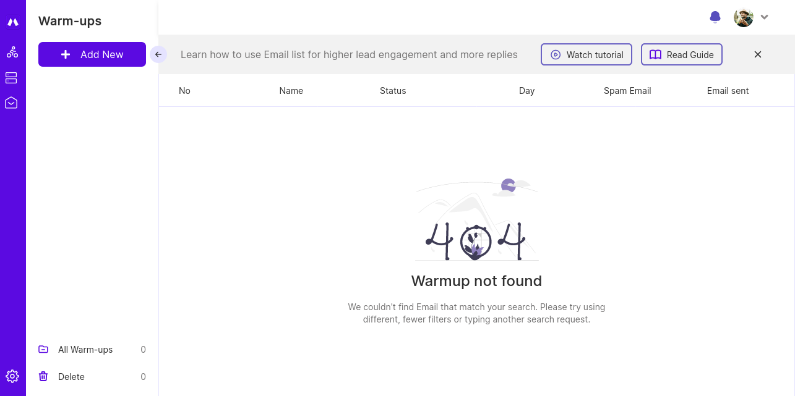

# Magicpitch Warmup Frontend
Intuitive interface for managing warmups

## Running the project using docker
```bash
# Clone repository
git clone https://github.com/infignity/PinterApp.git
cd PinterApp/

# Build a docker image
docker build -t pinterapp:v1 .

# Run a container using the image
docker run -d --name pinterapp -p 8080:8080 pinterapp:v1
```

## Setup
### setup env
- `NEXTAUTH_URL` set to the url of the website
- `NEXTAUTH_SECRET` run `openssl rand -hex 32` in terminal to get code

### install
- `npm i` - install dependencies
- `npm start` - run production server

## Pages
#### Home page

#### Warm up page

#### Create warmup

#### 404 

